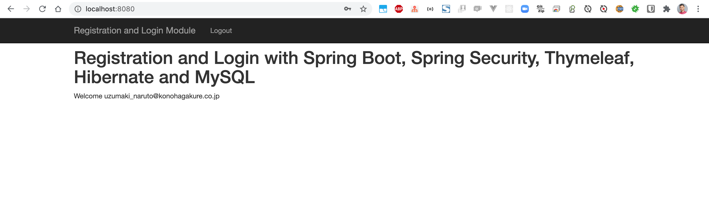
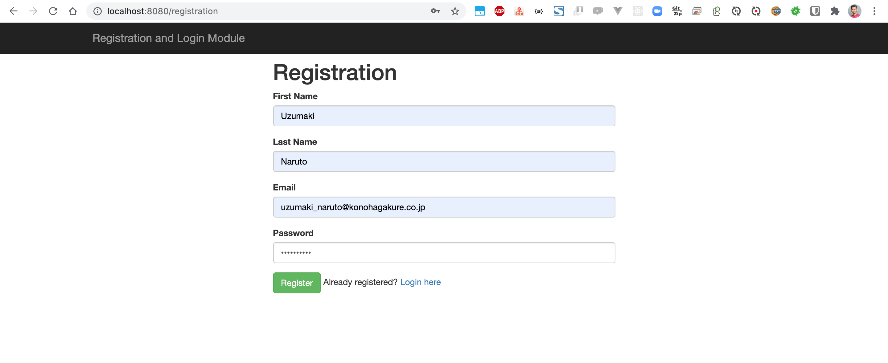
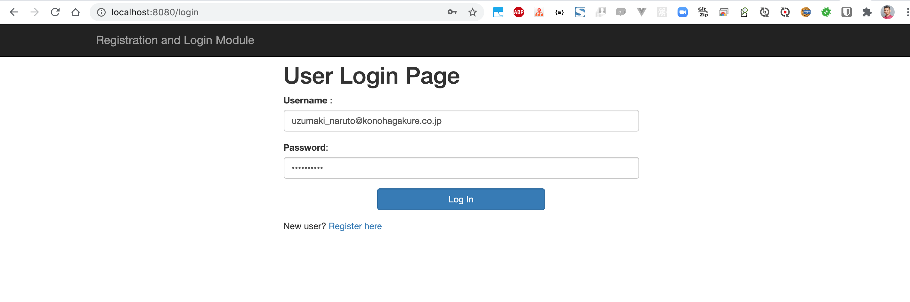

# springboot-registration-security-thymeleaf
### Things todo list:
1. Clone this repository: `git clone https://github.com/hendisantika/springboot-registration-security-thymeleaf.git`
2. Go inside the folder: `cd springboot-registration-security-thymeleaf`
3. Run the application: `mvn clean spring-boot:run`
4. Open your favorite browser: http://localhost:8080

### Images Screen shot

Home Page

Registration Page

Login Page

